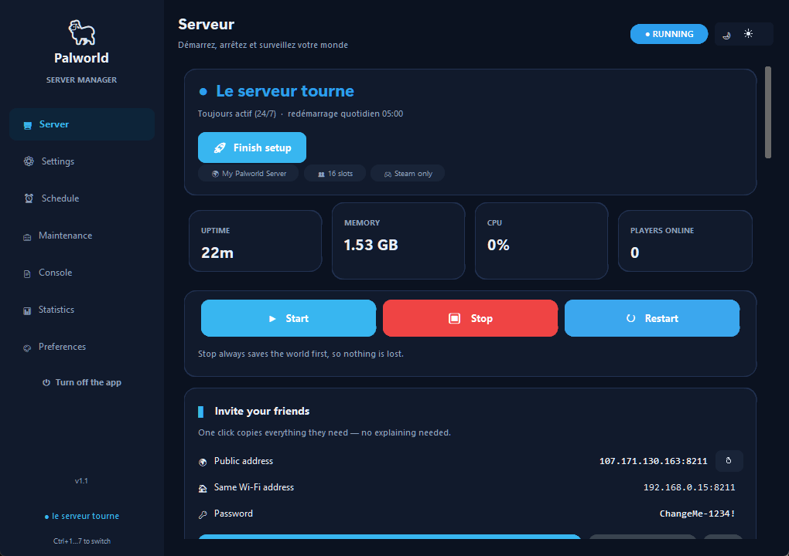
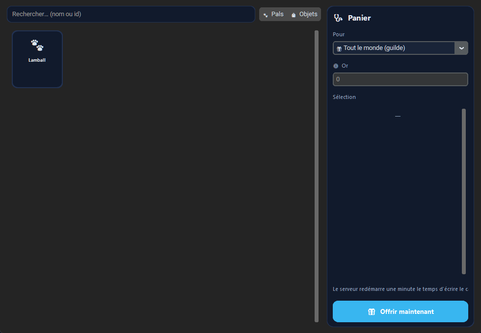

# Palworld Server Manager

A friendly desktop app that runs your own **private Palworld dedicated server** on your
PC — start/stop, live player management, every world setting in plain language,
scheduled restarts, SteamCMD updates, zip backups, and a visual **gift wizard** that
writes gold, items (1 100+ with real game icons) and Pals (600+ with artwork)
directly into the world save — no mods required.




**Windows 10/11 · French + English UI · single executable · no server knowledge needed**

> 🇫🇱 **Version française** : application de gestion pour votre serveur Palworld
> dédié privé — démarrage, joueurs en direct, réglages du monde en français,
> mises à jour, sauvegardes, redémarrages programmés et assistant de cadeaux
> visuel (or, objets, Pals) écrit directement dans la sauvegarde, sans mods.
> Guide complet : `docs/Manuel_Utilisateur.pdf`, installation : `docs/SETUP.md`.

---

## Highlights

| | |
|---|---|
| 🎮 **Full server control** | start / stop / restart, live players, broadcast, kick/ban, remote console output |
| ⚙️ **Every setting, explained** | all the world options (XP rates, capture, death penalty, pals per base, crossplay…) in plain language, validated ranges, presets (peaceful / normal / hardcore / pvp) |
| 📅 **Runs itself** | 24/7 or schedule windows, daily restart, crash watchdog with auto-restart and diagnosis |
| 💾 **Backups that restore** | timestamped zip backups, one-click restore, integrity check, optional offsite copy |
| 🔄 **Steam updates** | one-button SteamCMD update with live log; update badge when Pocketpair ships a patch |
| 🎁 **Gift wizard (no mods)** | gold, 1 100+ items and 600+ Pals with their real game artwork, written safely into the save (auto-backup + auto-restore on failure) |
| 👥 **Guild dashboard** | playtime, sessions timeline, inventories, guild card export, Steam avatars, weekly recap, trophies |
| 🔔 **Discord webhooks** | announces joins, updates, gifts, weekly recap; optional automatic password rotation |
| 🇫🇷 **Bilingual** | full French / English interface |

## Requirements

- **Windows 10/11** (64-bit). ⚠️ **Not for macOS or Linux**: Pocketpair ships
  Palworld dedicated-server binaries for Windows only (Linux via SteamCMD
  without this GUI). There is **no macOS Palworld dedicated server** — this app
  cannot change that; host on a Windows PC.
- ~10 GB free disk for the game server, 4 GB RAM spare, a always-on-ish PC.
- The game (any platform) is only needed on the *players'* side.

## Install (5 minutes)

1. Make a folder, e.g. `C:\PalworldServer`.
2. Unzip this archive **into that folder** (you should get `PalworldControl.exe`
   next to an `app` folder).
3. Follow **`docs/SETUP.md`** — it walks you through installing SteamCMD and the
   Palworld dedicated server (two commands), the first launch, and opening the
   server to your friends (port-forward + crossplay for Steam/Xbox/PS5).

Full documentation: **`docs/Manuel_Utilisateur.pdf`** (French user manual, 15
pages with screenshots).

## Build from source

```bash
pip install -r requirements.txt
python -m PyInstaller --onefile --noconsole --name PalworldControl palworld_control.py ^
  --icon app.ico --hidden-import pystray._win32 --hidden-import qrcode
```

## Project layout

```
PalworldControl.exe   the app (prebuilt, or build it from source)
palworld_control.py   full source (one file, ~7 000 lines)
app/tools/            save toolkit (scan / gift / verify) + embedded Python
docs/                 SETUP.md + user manual (PDF)
screenshots/          UI screenshots
```

## Credits & license

- Code: MIT (see `LICENSE`).
- Save toolkit: [PalworldSaveTools](https://github.com/cheahjs/palworld-save-tools) (MIT) and
  the [Palworld-Pal-Editor](https://github.com/KrisCris/Palworld-Pal-Editor)
  community asset set (item/pal icons and localized names — downloaded
  automatically on first use).
- UI: CustomTkinter, pystray, Pillow, qrcode, psutil.
- This is a fan-made tool, not affiliated with or endorsed by Pocketpair.
  Palworld © Pocketpair.
